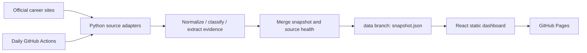

# Job Skill Radar

**See the skills behind the role.** A bilingual, evidence-backed explorer of early-career AI, computer vision, 3D / SLAM and ECE software jobs in the US and China.

[Dashboard](https://jieera.github.io/job-skill-radar/) · [中文说明](docs/README.zh-CN.md) · [Methodology](docs/methodology.md) · [Source verification](docs/sources.md)

## What it does

- Reads public employer career pages and APIs. No paid model, account scraping or application submission.
- Normalizes Chinese / English skill aliases and keeps original evidence, separating **required**, **preferred**, **mentioned**, and **uncertain**.
- Filters by market, company, field, level and skill; compares market-specific coverage and exports evidence to CSV.
- Refreshes daily through GitHub Actions and publishes a static React dashboard to GitHub Pages.
- Keeps prior data when a source fails. Partial scans refresh valid records without expiring missing jobs. Only two complete successful scans can mark a missing role closed.

**Coverage is deliberately explicit:** Apple US internships and Tencent campus technical roles are connected. NVIDIA internships / new graduate roles are connected with incomplete upstream records surfaced as partial scans. Microsoft, ByteDance and Huawei are listed as pending adapters. This is a sample of selected employers, not a market-wide census. See the live source panel for the latest state.

## Run locally

Requirements: Python 3.11+, curl, Node.js 24+, npm. The collector uses the Python standard library and the operating system's verified TLS trust store. No API keys are required.

```sh
# from this repository root
python3 -m radar.cli
# exit 2 = failed/partial source; the snapshot still contains usable data and status
cd web
npm ci
npm run dev
```

The checked-in snapshot lets you explore the dashboard without running a fresh crawl. All displayed timestamps are actual capture times, not simulated live values. The date a job was first discovered is not its publication date.

```sh
python3 -m radar.cli --sources apple tencent
python3 -m unittest discover -s tests -v
cd web
npm test
npm run build
```

## Architecture



- `config/sources.json`: source registry, adapter type and documented coverage.
- `config/skills.json`: canonical skills and bilingual aliases.
- `radar/`: transport, pagination, extraction, merge and CLI.
- `web/`: React / TypeScript dashboard. All filtering happens locally.
- `scripts/snapshot_branch.py`: isolated data-branch persistence without checking out that branch.
- `tests/`: offline regression tests; `docs/evaluation/`: evaluation data and review status.

Snapshot contract: `schema_version`, `generated_at`, `sources[]`, `jobs[]`. Jobs include stable source IDs, URLs, location-derived markets, multi-label categories, seniority, skill evidence, first/last-seen timestamps, activity and absence counters. Descriptions are processed locally; the published dataset includes evidence excerpts rather than complete job pages. No public server API is required.

## Deploy your own fork

1. Fork this repository and enable Actions.
2. In **Settings → Pages**, select **GitHub Actions** as the build source.
3. Run **Collect and deploy** from the Actions tab.
4. Keep workflow write permissions available for the `data` branch. The workflow declares `contents: write`, `pages: write`, and `id-token: write`.

The scheduled run is **07:23 UTC daily**, with manual dispatch and main-branch push triggers. A single concurrency group prevents overlapping data writes. The `data` branch holds snapshots; `main` holds code and an initial snapshot. The workflow restores the latest data, collects, persists, builds and deploys. Source failures are reported after deployment so the dashboard can show them rather than silently freezing.

GitHub schedules can be delayed. Public-repository schedules may be disabled after 60 days without repository activity; check the Actions page and re-enable them when needed. See [GitHub scheduling docs](https://docs.github.com/en/actions/reference/workflows-and-actions/events-that-trigger-workflows). A first successful manual run verifies the pipeline; the schedule itself is only demonstrated after its first scheduled run.

For forks, update the GitHub links in the dashboard and collector user agent. Relative asset paths support project Pages URLs.

## Evaluation and limitations

Offline tests cover normalization, evidence levels, pagination, duplicates, source failure, partial scans, reopening and expiry, coverage denominators, filtering and CSV escaping. A [40-excerpt review corpus and reproducible evaluation](docs/evaluation/README.md) are supplied separately (agent-reviewed baseline: 100% precision, 87.8% recall; not a production accuracy claim). **Agent-reviewed labels are not human-reviewed ground truth, and synthetic/regression test results are not real-job accuracy.** The 90% precision goal remains a human-review acceptance target until independently reviewed labels exist.

Role categorization and requirements are heuristic. Skills outside the dictionary can be missed. Alternative requirements such as “Python or C++” are two mentions, not two mandatory skills. Some campus pools represent multiple openings, and a single job may cover multiple locations. Do not interpret job counts as headcount.

## License and data

Code: [MIT](LICENSE). Recruitment descriptions, titles and evidence remain the property of their respective owners and are **not** relicensed by the code license. [Data provenance and use](DATA_SOURCES.md). Always verify availability and requirements on the original posting.
